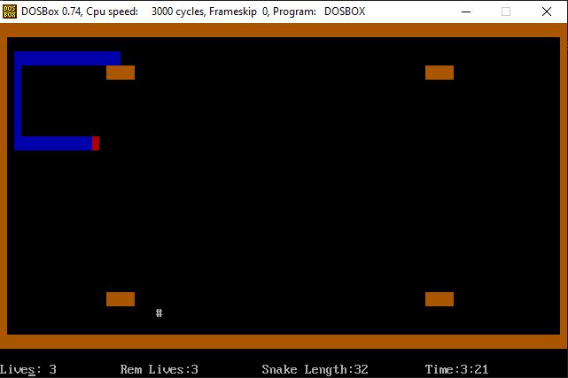

# Classic-Snake-Game

A clone of classic mobile snake game built in x86 Assembly

# To Run:

- Open Dosbox and Go to the directory of Game.asm
- Make sure your nasm assembler is also placed there.
- Run nasm Game.asm -o Game.com
- Run Game

# ScreenShots:

